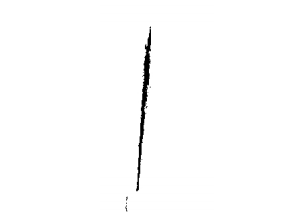

# Escaner-Grafica
Proyecto final escaner en 3d para el curso de computacion grafica csunsa

Alumnos:  
         Patrick Lazo Colque  
         Luis Mamani Chirinos  
         Kevin Valverde Huilca  
         
El proyecto consiste en crear un escaner 3d con poco presupuesto para ello
se eligio un escaner 3d usando laser y nube de puntos.

## 1. Materiales Utilizados

### 1.1 Objeto a escanear

### 1.2 Plataforma

### 1.3 Láser con led

### 1.4 Ambiente controlado

## 2. Fases de procesamiento del Escaner

### 2.1 Escaneo del objeto

### 2.2 Binarización del objeto

### 2.3 Construcción del Objeto

